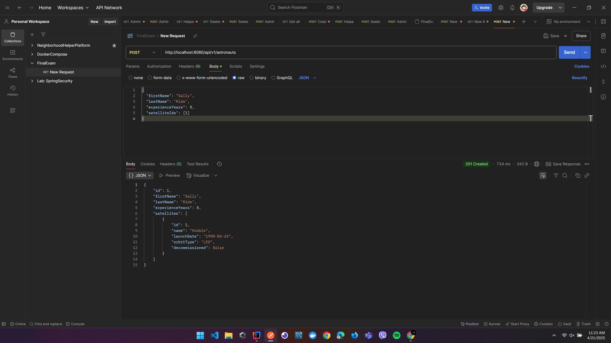
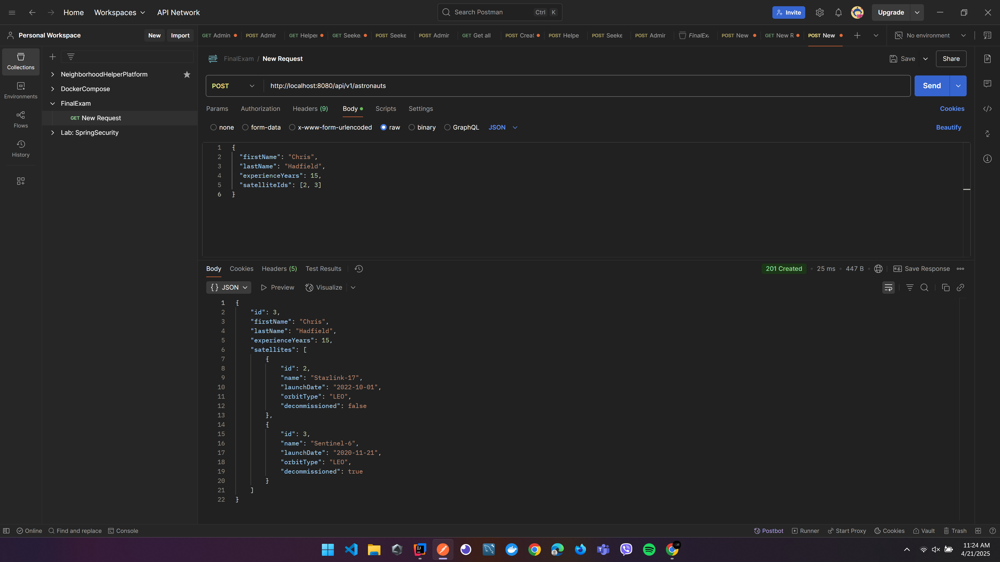
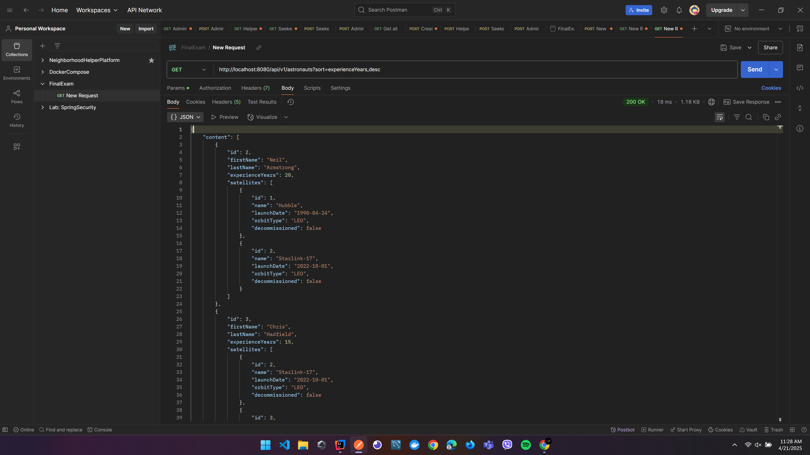
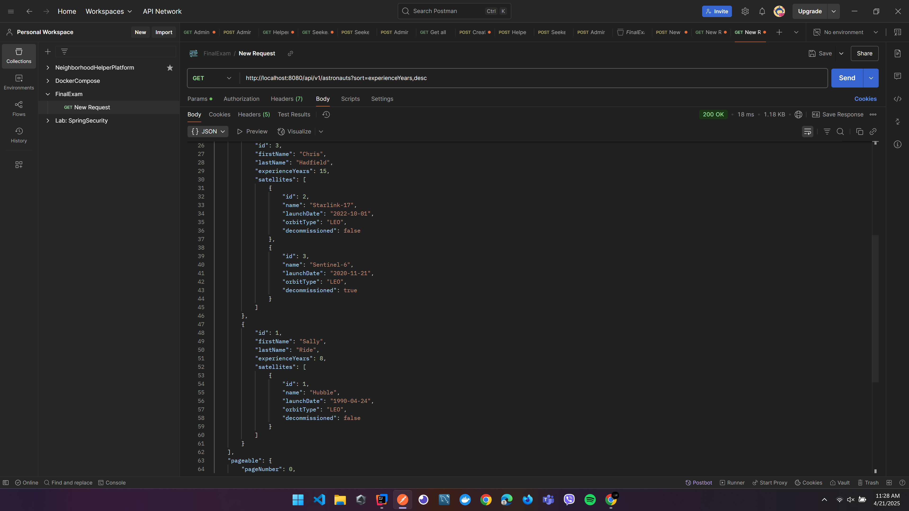
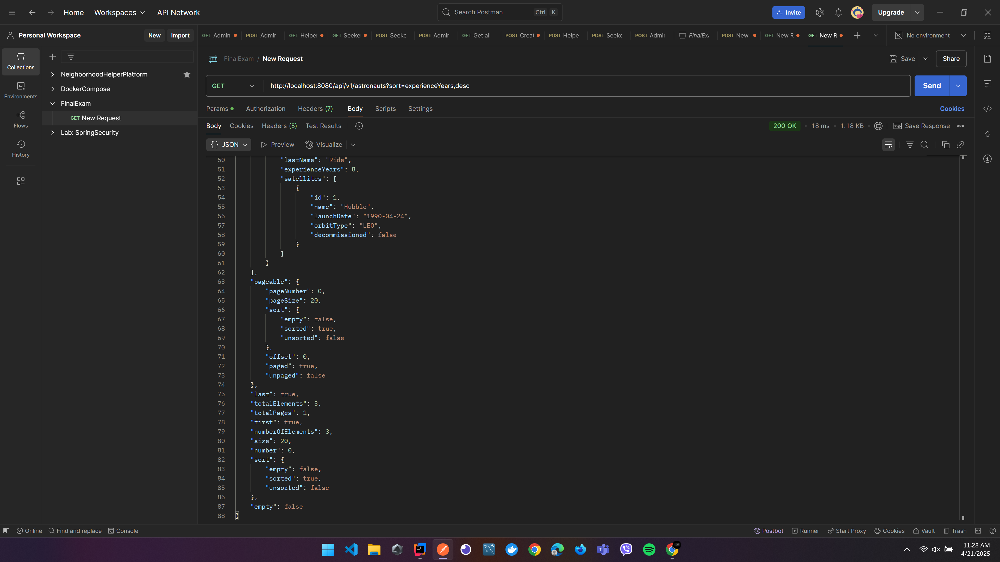
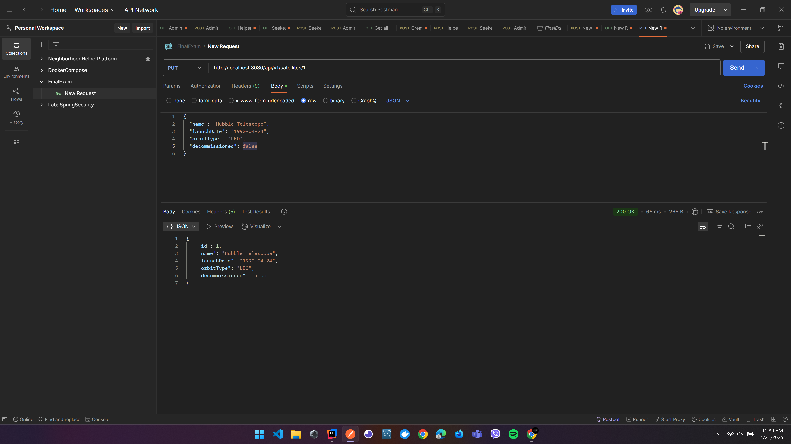
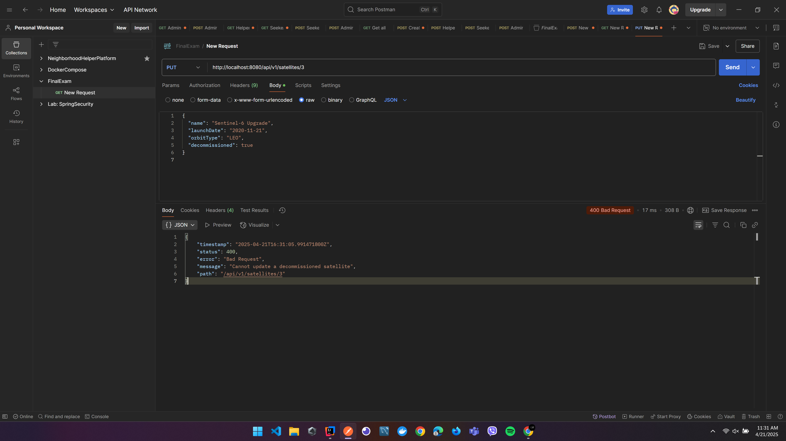
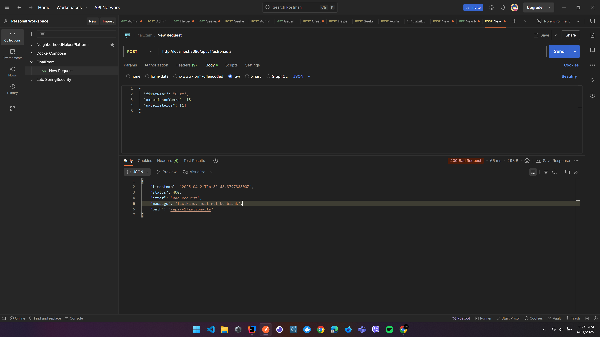
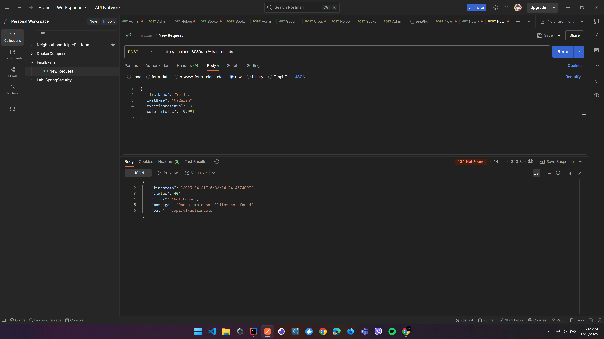

# 🚀 Mission Control: Satellite-Astronaut Tracking System

This Spring Boot REST API allows you to manage astronauts and satellites, including their assignments, updates, and validations.

---

## 📦 Tech Stack

- Java 17
- Spring Boot
- Spring Data JPA
- Hibernate Validator
- PostgreSQL
- MapStruct
- Lombok
- Postman (for testing)

---

## 📁 Features Implemented

✅ Data Persistence with JPA  
✅ `@ManyToMany` relationships  
✅ DTO + Mapper architecture using MapStruct  
✅ RESTful endpoints with `@RestController`  
✅ Full validation via `@Valid`, `@NotBlank`, `@Pattern`, `@Past`  
✅ `ResponseEntity<>` + proper HTTP status codes  
✅ Exception handling with `@RestControllerAdvice` and `ApiError`  
✅ Pagination & sorting using `Pageable`, `PageRequest`

---

## 🔧 How to Run

1. Configure PostgreSQL and set credentials in `application.properties`
2. Run the application 

---

## 📸 Screenshot 

1. 🎯 POST /api/v1/astronauts
Create a new astronaut with a list of satellite IDs.

✅ Sample Request
{
  "firstName": "Neil",
  "lastName": "Armstrong",
  "experienceYears": 20,
  "satelliteIds": [1, 2]
}
  
  
  

2. 📄 GET /api/v1/astronauts?page=0&size=5&sort=experienceYears,desc
Get all astronauts (paginated & sorted)
  
  
  

3. ✏️ PUT /api/v1/satellites/{id}
Update a satellite if it's not decommissioned.

✅ Request:
{
  "name": "Hubble Telescope",
  "launchDate": "1990-04-24",
  "orbitType": "LEO",
  "decommissioned": false
}
  

4. ❌ PUT /api/v1/satellites/{id} (Decommissioned)
Attempt to update a decommissioned satellite.
  

5. ⚠️ POST /api/v1/astronauts (Validation Failures)
  a. Missing field:
  {
    "firstName": "Buzz",
    "experienceYears": 15,
    "satelliteIds": [1]
  }
  

  b. Invalid satellite ID:
  {
  "firstName": "Yuri",
  "lastName": "Gagarin",
  "experienceYears": 10,
  "satelliteIds": [9999]
  }
  

Thank you!!
